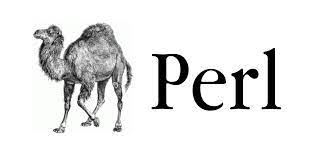

## Seminário de Linguagens de Programação

---

Membros

* Gabriel Tiso
* João Gabriel 
* Luis Eduardo
* Pedro Tiso 

---



---

## História e Surgimento da linguagem

---

- Criada em 1987 por Larry Wall (4 anos antes do surgimento do kernel Linux)
- Linguagem open source

--

- Foi criada com a intenção de unificar aspectos que se destacavam em ferramentas de manipulação de texto, tais como
    * Expressões regulares do programa `sed`
    * Identificação de padrões do `awk`
    * Sintaxe baseada em C e em linguagens de Shell scripts

--

> There's more than one way to do it

---

### Paradigma e domínio de aplicação (onde / para o que é utilizada?)

---

- Possui suporte aos paradigmas funcional, orientado a objetos e procedural
- Entre os diversos usos da linguagem Perl, se destacam os seguintes domínios:
    * Tarefas administrativas em sistemas UNIX (Criação de scripts)
    * Ideal para programação web devido às suas capacidades de manipulação de texto, bem como 
        ao seu rápido ciclo de desenvolvimento

---

## Escopo, variáveis e tipos de dados

---

- Variáveis geralmente são prefixadas com a keyword `my`, para representar
valores locais.
- Um nome válido começa com uma letra ou underscore, seguida de qualquer número de 
letras, underscores e números

--

- Em Perl, variáveis podem ser classificadas de três formas com relação ao tipo:
    * Escalar: Prefixados pelo símbolo `$`, representam valores únicos, que podem 
    ser strings, inteiros e de ponto flutuante.

    * Strings em aspas duplas interpretam símbolos de escape como "\n", bem como outras
    variáveis. Strings em aspas simples escapam esses símbolos e os armazenam na string 
    como valores literais.

-- 

```perl
my $animal = "camel"
my $answer = 42
```

--

* Array: Representam uma lista de valores. São prefixados pelo símbolo `@`.

```perl
@animals = ("camel", "llama", "cow");
@numbers = (2, 3, 5);
@mixed   = ("camel", 42, 1.23);
```

--

* Hash: Representa um conjunto de pares chave/valor. São prefixados
pelo símbolo `%`.

```perl
%prices = (
    apple => 1.59,
    banana => 1.25,
    watermelon => 5.45
)
```

--- 

## Estruturas de controle (decisão e repetição)

---

- Perl possui estruturas de decisão bastante similares às lingagens baseadas em C.

```perl
if ($var) {
  ...
} elsif ($var eq 'bar') {
  ...
} else {
  ...
}
```

```perl
# Outra forma de implementar a expressão `if (!condition)`
unless (condition) {
    ...
}
```

--

- Suas estruturas de repetição também são simples

```perl
while (condition) {
  ...
}

my $reps = 5;
for my $i (0 .. $reps) {
  print "index is $i";
}
```

```perl
# iterando sobre um array
for my $element (@elements) {
  print $element;
}

# iterando sobre as chaves de um hash.
foreach my $key (keys %hash) {
  print $key, ': ', $hash{$key}, "\n";
}
```

---

## Funções / Métodos

---

- As funções ou subrotinas possuem uma declaração simples e 
de fácil entendimento.

- Utilizamos a keyword `sub` para indicá-las, seguido do corpo da função
delimitado pelas chaves

- Os parâmetros passados pelos chamadores encontram-se em um array especial, `@_`.

--

```perl
sub write_name_to_file {
    my @params = @_;
    my $name = $params[0];

    open(my $fh, ">", "name.txt")
        or die "Can't open > name.txt $!";

    print $fh "Hello, $name!\n";
}

write_name_to_file("Gabriel");
```

---

## Características extras 

---

- Uma das features mais importantes e famosas da linguagem Perl são as suas
capacidades de processamento de string e expressões regulares (Regex)

--

- Para verificar se uma determinada string contém o conteúdo especificado por uma 
expressão regular, podemos usar a seguinte sintaxe:

```perl
# Checa se o match existe
"Hello World" =~ /World/;

# Checa se o match não existe
"Hello World" != /World/;
```

--

- Também podemos utilizar variáveis dentro das expressões regulares:
```perl
my $greeting = "everyone"
print "Matches!\n" if "Hello everyone" =~ /$greeting/;
```

--

- Se uma regex encontrar o padrão em mais de um lugar na string, Perl sempre realizará um match no ponto mais inicial da 
string:
```perl
"Hello World" =~ /o/;       # match no 'o' de 'Hello'
"That hat is red" =~ /hat/; # match no 'hat' de 'That'
```

--

- Os operadores de regex utilizados rotineiramente também estão presentes na linguagem. Alguns exemplos são:
```perl
$x = 'bcr';
/[$x]at/;   # match em 'bat', 'cat', ou 'rat'
/item[0-9]/; # match em item0 or item1 or ... or item9
```

--

- Também é possível extrair valores de uma determinada string:
```perl
($hours, $minutes, $second) = (
        $time =~ /(\d\d):(\d\d):(\d\d)/
);
```

--

- Search and Replace
```perl
$x = "I batted 4 for 4";
$x =~ s/4/four/;   # $x contém "I batted four for 4"
$x = "I batted 4 for 4";
$x =~ s/4/four/g;  # $x contém "I batted four for four".
                   # Observe a adição do operador `g`
```

--

- Split
```perl
$x = "Perl é legal";
@word = split /\s+/, $x;  # $word[0] = 'Perl'
                          # $word[1] = 'é'
                          # $word[2] = 'legal'
```

---

## Ambientes de desenvolvimento (IDEs)

---

- Padre. IDE para a linguagem Perl, escrita em Perl
- VSCode, Intellij e outras IDEs tambem possuem suporte por meio de plugins

---

## Principais bibliotecas e frameworks

---

- Mojolicious: Framework para a web. Possui suporte para rotas REST, plugins, templates, gerenciamento de sessões e 
muito mais

--

- DBI - Database independent interface for Perl: É um módulo de acesso à bancos de dados para a linguagem Perl.
De acordo com a documentação oficial: "Ele define um conjunto de métodos, variáveis e convenções que fornecem 
uma interface de banco de dados consistente, independente do banco de dados real que está sendo usado."

--

- JSON: Ferramenta capaz de codificar e decodificar estruturas do tipo JSON

---

## Curiosidades e cases de projetos que usam a linguagem

---

- Inicialmente se chamaria PEARL, porém, uma linguagem com esse nome já existia, e o nome
    foi alterado para Perl

---

## Obrigado!
